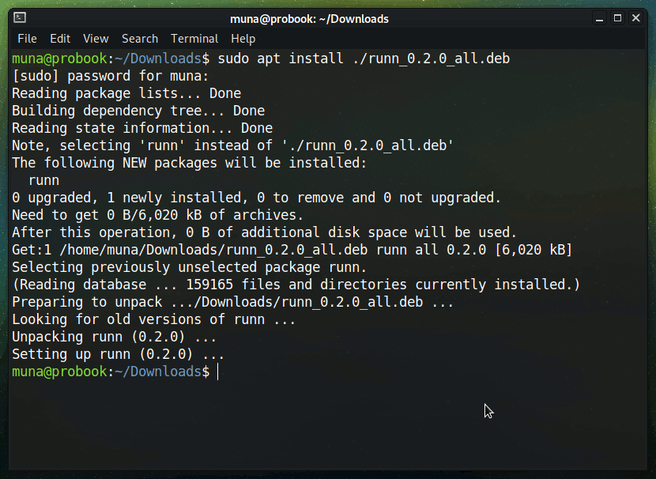

<br />
<div align="center">
  <div align="center">
    
</div>

 <h3 align="center">Runn - A task runner of sorts</h3>

  <p align="center">
Runn is a powerful and flexible task runner, designed to automate repetitive and time-consuming tasks. It is written in Python, making it easy to use and integrate into your existing workflows.
  </p>

</div>

<br/>
<br/>


## Key Features Goals
- Task Definition: Ability to define and organize tasks in a clear and concise manner.
- Dependency Management: Ability to specify task dependencies so that tasks are executed in the correct order.
- Parallel Execution: Ability to run multiple tasks in parallel to improve performance and efficiency.
- Error Handling: Ability to handle errors and provide useful error messages to help identify and resolve problems.
- Plugins and Extensions: Ability to extend the functionality of the task runner with plugins and extensions.
- Cross-Platform Compatibility: Ability to run on multiple platforms, including Windows, macOS, and Linux.
- Customizable Output: Ability to customize the output of the task runner to better suit the needs of the user.
- Reporting: Ability to generate reports that provide insights into the execution of tasks and help identify areas for improvement.
- Scheduling: Ability to schedule tasks to run at specific times or intervals, either automatically or on demand.
- Version Control Integration: Ability to integrate with version control systems like Git, so that changes to tasks can be tracked and managed effectively.

## Getting Started
To get started with Runn, follow these steps:
1. Download the release .deb file here [v0.2.0-alpha](https://github.com/munabedan/Runn/releases/tag/v0.2.0-alpha)
2. Install the package with apt.

```bash
    sudo apt install ./runn_0.2.0-alpha_amd64.deb
```
3. In your project folder run the following command to initialize a runn project. You will be asked to create a script directory accept with `y`.

```bash
    runn
```
4. Use the command the following command to create a new task. Provide the name of the task and the extension of the script you want to create. Python and bash scripts are supported.

```bash
    runn create
```

5. Edit the script file in the scripts directory. You can use the following command to run the task.

```bash
    runn script_name
```


## Contributing
We welcome contributions to the Runn project. If you would like to contribute, please follow these steps:
1. Fork the Runn repository on GitHub.
2. Clone your fork to your local machine.
3. Make your changes.
4. Commit your changes and push to your fork on GitHub.
5. Submit a pull request to the Runn repository.

## License
Runn is released under the MIT License. See the LICENSE file for more information.
